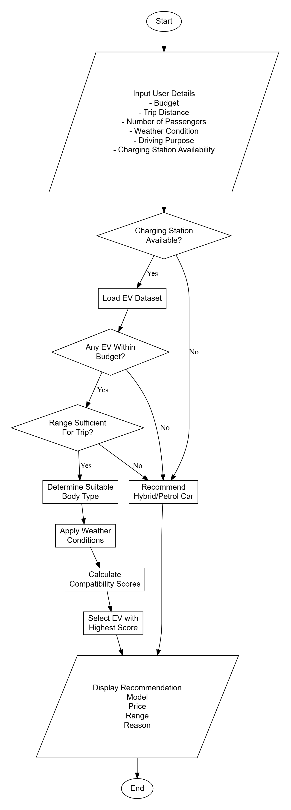
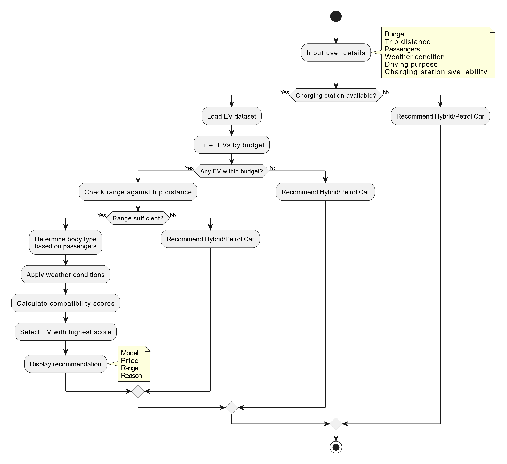

# EV Recommendation System

## Data Sources

The EV vehicle data used in this project is obtained from:

1. Zigwheels Malaysia  
   https://www.zigwheels.my/new-cars/electric

2. Proton e.MAS Official Website  
   https://emasproton.com.my/pricelist/

---

## EV Models Available in Malaysia

| Model | Price (RM) | Range (km) | Body Type | Best For |
|---------|---------:|---------|------------|------------|
| Proton e.MAS 5 | 56,800 | 325 | Hatchback | Students |
| Proton e.MAS 7 | 99,800 | 345-410 | SUV | Family |
| BYD Dolphin | 100,530 | 340-490 | Hatchback | City driving |
| BYD Atto 3 | 125,800 | 420-480 | SUV | Family |
| BYD Seal | 171,800 | 570 | Sedan | Performance |
| Tesla Model 3 | 189,000 | 513-629 | Sedan | Long distance |
| Tesla Model Y | 199,000 | 533-622 | SUV | Family and travel |
| MG4 EV | 103,999 | 350-520 | Hatchback | Young users |
| MG ZS EV | 125,999 | 440 | SUV | Daily commute |
| ORA Good Cat | 109,800 | 400-500 | Hatchback | Urban driving |
| Neta V | 100,000 | 384 | Hatchback | Budget |
| Neta X | 119,888 | 480 | SUV | Family |
| Xpeng G6 | 166,000 | 570 | SUV Coupe | Technology enthusiasts |
| Zeekr X | 155,800 | 440 | SUV | Premium users |
| BMW iX1 | 280,000 | 440 | SUV | Luxury |
| Porsche Taycan | 575,000 | 500 | Sedan | Performance |

---

## Vehicle Body Type

| Body Type | Suitable Number of People |
|------------|-------------------------|
| Hatchback | 1–3 people |
| Sedan | 2–5 people |
| SUV | 4–7 people |
| MPV | 6–8 people |

---

# Program Inputs

The program requires the following inputs:

- User budget (RM)
- Planned trip distance (km)
- Number of passengers
- Weather condition
- Nearest charging station availability
- Driving purpose
- Preference (performance, family, city driving, luxury, etc.)

---

# Decision Rules

## Condition 1: Charging Station Availability

The first condition to check is whether there is an EV charging station nearby other than the user's home.

### If NO:

Recommend:

- Hybrid vehicle
- Petrol vehicle

Reason:

- Limited charging infrastructure
- High range anxiety
- EV ownership may not be practical

---

### If YES:

Continue to calculate compatibility scores for all EV models and recommend the vehicle with the highest score.

---

# Vehicle Compatibility Conditions

## Budget

Vehicle price must be less than or equal to the user's budget.

Example:

- Budget = RM120,000
- Eligible vehicles:
  - Proton e.MAS 5
  - Proton e.MAS 7
  - BYD Dolphin
  - ORA Good Cat
  - Neta V

---

## Trip Distance

Vehicle range must be greater than or equal to the planned trip distance.

Example:

- Planned distance = 350 km
- Vehicles with range ≥ 350 km are considered.

---

## Family Size

| Number of People | Preferred Body Type |
|-----------------|---------------------|
| 1–3 | Hatchback |
| 2–5 | Sedan |
| 4–7 | SUV |
| 6–8 | MPV |

---

## Weather Condition

| Weather Condition | Recommendation |
|------------------|----------------|
| Normal | All EVs |
| Heavy Rain | SUV preferred |
| Flood-prone Area | SUV preferred |
| Long-distance + Bad Weather | Consider hybrid or petrol car |

---

## Driving Purpose

| Driving Purpose | Preferred Vehicles |
|----------------|-------------------|
| Student | Proton e.MAS 5 |
| City Driving | BYD Dolphin |
| Family | Proton e.MAS 7, BYD Atto 3 |
| Long Distance | Tesla Model 3, Tesla Model Y |
| Performance | BYD Seal, Porsche Taycan |
| Technology | Xpeng G6 |
| Luxury | BMW iX1 |

---

# Output

The program returns:

- Recommended vehicle type (EV / Hybrid / Petrol)
- Best matching EV model
- Price
- Driving range
- Body type
- Best use case
- Compatibility score
- Recommendation explanation

---

# Example Output

## Recommended Vehicle Type

EV

## Best Match

Proton e.MAS 7

### Details

- Price: RM99,800
- Range: 410 km
- Body Type: SUV
- Best For: Family

### Compatibility Score

95%

### Reason

- Within budget
- Suitable for 4–5 people
- Enough range for the trip
- Charging station available nearby
- SUV is suitable for rainy weather

---

## Flowchart 1

## Flowchart 2 - Better Graphical

